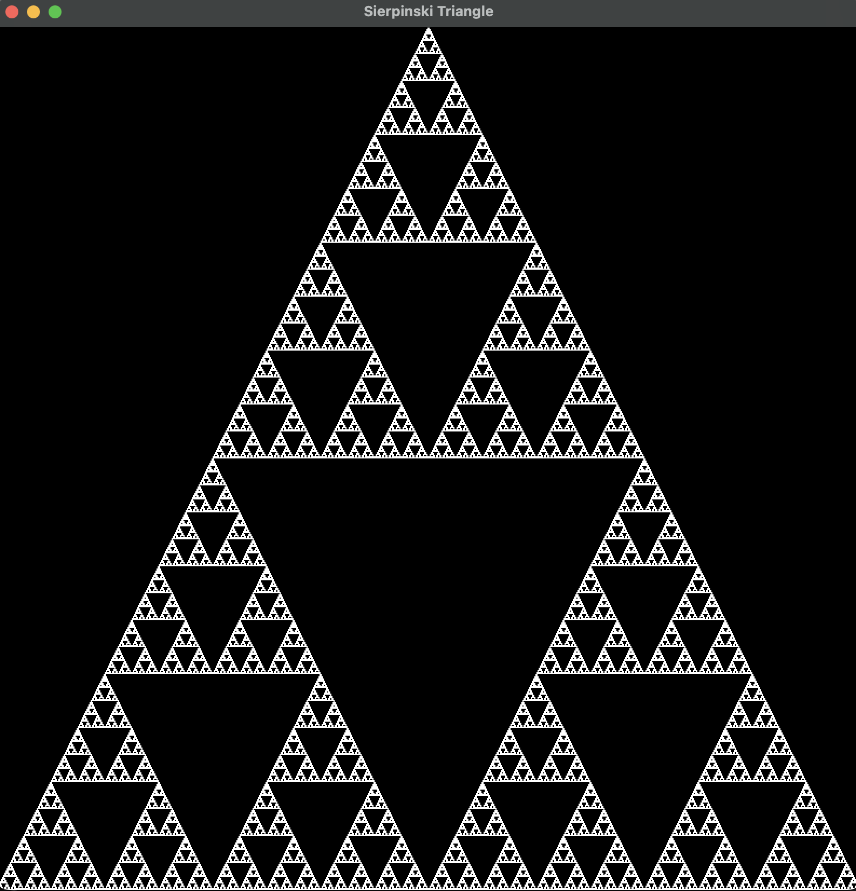

# Sierpinski Triangle

This is a simple program that generates a Sierpinski Triangle using SFML.

## How to run
Make sure you are in the `Sierpinski Triangle` directory.

### Option 1 - Default Dimensions
Compile: `cmake -B build -DCMAKE_BUILD_TYPE=Release && cmake --build build --config Release`

Build: `./build/bin/sierpinski`

### Option 2 - Custom Dimensions
Add a custom precision number. Default is 1 pixel. 

Compile: `cmake -B build -DCMAKE_BUILD_TYPE=Release && cmake --build build --config Release`

Build: `./build/bin/sierpinski <number>`

## Note
You might not be able to run this from this repo. You can copy the files and run it on your local machine. Just make sure that `add_executable(main 100LinesOfCode/Sierpinski Triangle/main.cpp)` in `CMakeLists.txt` is changed to the right path.

</img>